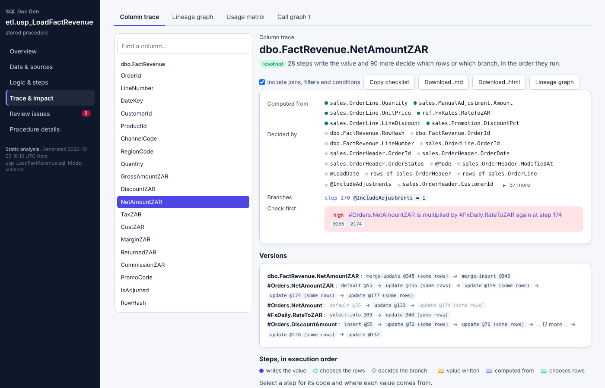
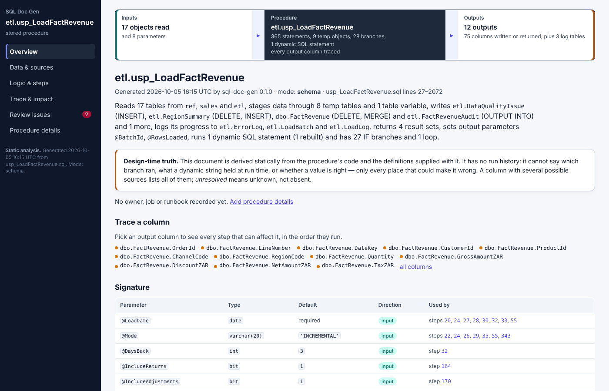
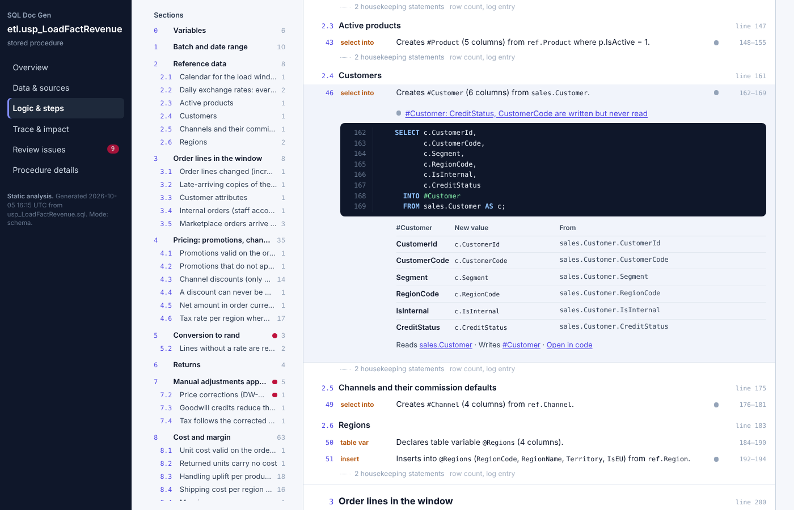
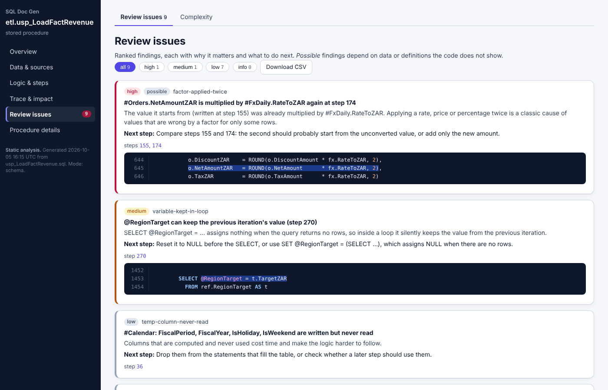
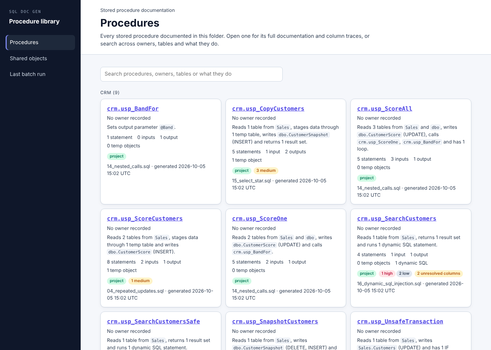

# sql-doc-gen

Living documentation and column lineage for T-SQL stored procedures.

Point it at a `.sql` file, a folder or an SSDT project, and it writes one self-contained HTML page per
procedure: what the procedure reads and writes, every step in plain language, and a column trace that
shows every statement that can affect an output column. It also writes ranked review issues, a library
home page, and Word, CSV, JSON and agent-markdown exports.

Microsoft ScriptDom (the parser SQL Server's own tools use) parses the code, and Python does the
analysis. It never connects to a database: everything comes from the code and any table definitions
you supply.



## Try it in two minutes

You need Python 3.9 or newer and the .NET SDK 8 or newer (`dotnet --version`). The first run builds a
small ScriptDom helper into your cache folder, which takes under a minute and needs nuget.org once.

```bash
pip install .                      # or run python generate_docs.py ... from the checkout
sql-doc-gen --doctor               # checks .NET and builds the helper

# the demo: a 2,000-line ETL procedure with one planted bug
sql-doc-gen examples/large/usp_LoadFactRevenue.sql --schema examples/large/schema.sql --output-dir demo
```

Open `demo/etl.usp_LoadFactRevenue.html`. The page needs no server and no internet, and you can email
it as a single file.

**What to look for.** Open *Trace & impact*. It starts on `dbo.FactRevenue.NetAmountZAR`, and its
*Check first* box shows the planted bug: in section 7.2 of the procedure (step 174), orders with a
price adjustment are multiplied by the exchange rate a second time, so those rows come out about 20×
too high for EUR orders. The trace lists the 28 steps that write the value, in order. The one under
`IF @IncludeAdjustments = 1` is the one that runs only on some days, which is why a bug like this
survives testing.

Review issues found one more problem that was not planted: inside the cursor loop at step 270,
`SELECT @RegionTarget = …` keeps the previous region's target when a region has none.

## Three modes: what the document may claim

| Mode | Input | What resolves |
|---|---|---|
| **Procedure only** | the procedure's `.sql` | Columns are tied to tables by name. `SELECT *` and unqualified columns can stay *Partial*. |
| **With schema** | `--schema` CREATE scripts, a folder, `.sqlproj`, `.dacpac` or a column-list `.csv` (for example an `INFORMATION_SCHEMA.COLUMNS` export) | `SELECT *` expands, columns resolve fully, and the key-based checks (duplicate joins, truncation) can run. |
| **Project** | a folder, an SSDT project, a `.dacpac`, or several procedures | Calls to supplied procedures, views and inline functions are expanded inline, so `INSERT … EXEC`, OUTPUT parameters and nested calls trace through. |

Every document carries a coverage table, *What this document can and cannot see*, listing statements
parsed, parse errors, unresolved columns, dynamic SQL (rebuilt, partial, unreadable), calls to objects
not supplied, `SELECT *` expanded or not, branches, and secrets withheld.

**Honesty rules.** The analysis is static. It never claims what ran: a column written in several
branches lists every possible source, with the conditions. Unresolved means unknown, not absent.

## The page

The six sections in the dark left rail match the Power BI and ADF documentation engines.

| Section | Views |
|---|---|
| **Overview** | Banner (inputs ▸ procedure ▸ outputs), a paragraph built from facts, counts, signature, coverage, *review first* |
| **Data & sources** | Inputs (columns used, steps that read them), Outputs (INSERT / UPDATE / MERGE / DELETE / TRUNCATE / SELECT INTO, result sets, OUTPUT parameters and clauses), Intermediates (temp tables, table variables, CTEs), Columns (sources, steps, conditions, status), Data flow diagram |
| **Logic & steps** | Steps (one line per statement, grouped under the procedure's own section comments, with housekeeping folded; each opens to its code, a column map, reads and writes), Control flow diagram, Transformations catalogue, Code (line numbers, every view links here) |
| **Trace & impact** | Column trace (described below), Lineage graph (upstream and downstream), Usage matrix (output columns × sources), Call graph |
| **Review issues** | Ranked findings, each with *why it matters* and a *next step*, plus Complexity |
| **Procedure details** | Owner, SQL Agent job, server, runbook and notes, edited in the page; *Download updated HTML* saves them into the file, and they survive regeneration |



**Steps.** Long ETL procedures spend many statements on bookkeeping: `SET @Rows = @@ROWCOUNT` after
every insert, a log row after every section, debug output, declarations. The Steps view folds these
into one quiet line per run (*2 housekeeping statements: row count, log entry*), so the statements
that move and decide data read straight through. *Every statement* shows them all. A statement counts
as logic when it can affect a business output: it moves data through tables, changes what runs next,
or feeds a value, row choice or branch that does. Log tables are recognised by name and use (written
only from variables and literals, never read back), so they are not counted as outputs. Section
comments such as `-- 2.1 Calendar for the load window` or a `/* ==== 3. Orders ==== */` banner become
the outline, with a table of contents that marks the sections holding a review issue.



**Column trace.** Pick an output column. The view lists, in execution order:

- every step that writes the value, with its formula shown; select a step for its code, with the
  expression highlighted, and where each input value comes from;
- the joins, filters and branch conditions that decide which rows get which value, folded into runs;
- each version of the intermediate tables (`#Orders.NetAmountZAR` after steps 155, 159, 174, 177), so overwrites are visible;
- the review issues on that path.

A trace exports as a checklist, or as a standalone HTML or markdown file you can attach to a ticket.

**Dynamic SQL.** The tool rebuilds the string from the code that assembles it: IF/ELSE variants,
`+=` chains, `CASE` on configuration variables, `REPLACE` templates, `QUOTENAME`, `CHAR(13)`. It then
analyses the result as nested steps, binding `sp_executesql` parameters (OUTPUT ones too). Values known
only at run time become named placeholders, so a table named by a parameter is shown as
*(object named by @TableName)*.

## Review checks

High findings are likely wrong results: a factor applied twice, `= NULL`, a LEFT JOIN turned inner,
a transaction left open, reading a table while it is still empty, parameters pasted into dynamic SQL
(SQL injection).

Medium findings are risky or ambiguous code:

- duplicate-producing joins (a non-key join where several rows can match)
- implicit conversions in joins and filters, possible truncation, `NOT IN` against a nullable column
- `TOP` without `ORDER BY`, `SELECT *` into tables, `INSERT` without a column list
- `NOLOCK` on business tables, a transaction outside `TRY/CATCH`
- a loop that can keep a variable's value from the previous iteration
- a temp table that is filled and never read, a write that is overwritten before it is read
- dynamic SQL that cannot be read

Low and info findings cover non-sargable predicates, cursors, `@@ERROR`, unreachable code, unused
columns, possible divide-by-zero, parameter sniffing and `OPTION (RECOMPILE)`.

The checks were tuned on real public code (see below) so that common safe idioms stay quiet:

- `IF @@ROWCOUNT = 0 BREAK` after a loop's `SELECT @x = …`, and a sentinel variable reset before it
- `WHILE EXISTS (…)` work queues
- NOLOCK on DMVs and temp tables
- header→lines joins, and columns filled from `NEXT VALUE FOR`
- `QUOTENAME` and quote-doubling in dynamic SQL
- command-runner procedures that execute caller-supplied SQL by design



## Other outputs

```bash
sql-doc-gen proc.sql --json --csv --word --agent --trace dbo.FactRevenue.NetAmountZAR
sql-doc-gen ./Database --output-dir docs        # every procedure plus docs/sql-home.html
sql-doc-gen --hub docs                          # rebuild the home page only
```

| Flag | Writes |
|---|---|
| `--json` | the analysis payload (also embedded in the page), with `schemaVersion` |
| `--csv` | `columns.csv`, `edges.csv`, `steps.csv`, `issues.csv` |
| `--word` | a narrative `.docx` handover |
| `--agent` | compact markdown for an LLM: claims and limits first, then trace tables |
| `--trace COL` | one column's trace as HTML and markdown |
| `--details FILE` | procedure details (owner, job, …) to embed |
| *(several procedures)* | `sql-home.html`: the library, grouped by folder or schema, with a **Shared objects** view (which procedures read or write each table) and the last batch run |



Endpoints use the same normalised shape as the other bi-doc engines
(`{system, server, port, database, schema, object, path, url, container}`), and the page speaks the
`bi-doc-viewer` iframe protocol v1, so it can later sit in the bi-doc-platform library as a third engine.

## Secrets

Secret values are masked in place, at the same length, before parsing. Code, line numbers and offsets
stay exact, and the masked values never reach any output. Masking covers:

- connection strings in `OPENROWSET` / `OPENDATASOURCE` (`PWD=`, `Password=`, account keys, SAS `sig=`)
- `PASSWORD =`, `OLD_PASSWORD =`, `SECRET =` and hashed `PASSWORD = 0x…` in login and credential statements
- `sp_addlinkedsrvlogin` passwords, named or positional
- all of the above inside dynamic SQL strings (doubled quotes, two levels deep) and in commented-out code
- bearer tokens

The page's details form refuses anything that looks like a secret.

## Tested on

- **Synthetic scenarios** (`examples/scenarios`): 16 files covering temp-table chains, `INSERT … EXEC`,
  stacked and recursive CTEs, repeated UPDATEs, `UPDATE … FROM`, MERGE with OUTPUT, IF/ELSE, table
  variables, cursors, WHILE, TRY/CATCH and transactions, resolvable and unresolvable dynamic SQL, SQL
  injection, nested calls, and `SELECT *` with and without a schema. Each file's header states the
  expected lineage, and `tests/test_scenarios.py` checks it in all three modes.
- **The large demo** (`examples/large`): generated by `build_large_procedure.py`, which states the
  planted bug.
- **Public code**, pinned in `tests/regress_public.py`:

| Target | Procedures | Statements | Output columns (not resolved) | Dynamic SQL (unreadable) | High | Medium | Seconds |
|---|---:|---:|---:|---:|---:|---:|---:|
| WideWorldImporters (SSDT project) | 178 | 2,022 | 1,624 (5) | 980 (0) | 0 | 6 | 16 |
| AdventureWorks install script | 10 | 51 | 93 (4) | 0 | 1 | 0 | 2 |
| Ola Hallengren maintenance solution | 4 | 3,599 | 109 (25) | 66 (0) | 0 | 0 | 7 |
| sp_Blitz | 1 | 1,971 | 73 (26) | 112 (0) | 1 | 2 | 8 |
| sp_BlitzCache | 1 | 1,361 | 1,113 (67) | 34 (0) | 0 | 0 | 5 |
| sp_BlitzIndex | 1 | 1,089 | 602 (149) | 51 (0) | 0 | 2 | 5 |

Some of the findings on public code look like real bugs:

- **WideWorldImporters `DataLoadSimulation.ReceivePurchaseOrders`.** The stock-holding UPDATE joins
  *every* purchase order line for the item. Unlike the INSERT just after it, it has no
  `pol.PurchaseOrderID = @PurchaseOrderID` filter, so an arbitrary line's quantity is added. This is
  reported as *possible-duplicate-join*.
- **WideWorldImporters `Integration.GetCityUpdates`.** It stores `Countries.CountryName`
  (nvarchar(60)) in `#CityChanges.Country` (nvarchar(50)), at three steps.
- **AdventureWorks `uspSearchCandidateResumes`.** It tests `IF @language = NULL`, which is never true.
- **sp_Blitz.** A WHERE condition on `ar.replica_server_name` turns a LEFT JOIN into an inner join.
- **sp_BlitzIndex.** In the database cursor loop, `SELECT @DatabaseID = … WHERE … state_desc = 'ONLINE'`
  keeps the previous database's id when a database is not online or not multi-user.

## Offline and locked-down machines

The helper is built once per machine and cached:

- Windows: `%LOCALAPPDATA%\sql-doc-gen`
- macOS: `~/Library/Caches/sql-doc-gen`
- Linux: `~/.cache/sql-doc-gen`

Without nuget.org access, point the build at a ScriptDom DLL you already have. SSMS, SqlPackage and
Visual Studio's SSDT all ship `Microsoft.SqlServer.TransactSql.ScriptDom.dll`.

```bash
SQLDOCGEN_SCRIPTDOM=/path/to/Microsoft.SqlServer.TransactSql.ScriptDom.dll sql-doc-gen --build-parser
```

| Variable | Use |
|---|---|
| `SQLDOCGEN_SCRIPTDOM` | build against a local ScriptDom DLL (no NuGet) |
| `SQLDOCGEN_PARSER` | use a helper built on another machine (`sqldocgen-parser.dll`) |
| `SQLDOCGEN_CACHE` | cache folder |

Options: `--parser TSql160` pins a parser version (default: the newest the DLL has);
`--no-quoted-identifier` parses with `QUOTED_IDENTIFIER OFF`; `--database` names the database for
three-part names; `--dump-tree FILE` prints ScriptDom's JSON for debugging.

## How it works

```
.sql / folder / .sqlproj / .dacpac
   │  decode (UTF-8/16, cp1252) → mask secrets in place → ScriptDom helper (.NET) → JSON syntax tree
   ▼
program.py    numbered steps, scopes, control-flow graph (TRY→CATCH, loops, RETURN, GOTO, THROW)
statements.py one handler per statement type: reads, writes, expressions → column versions
dataflow.py   reaching definitions over the CFG (partial writes do not kill earlier versions)
dynamic.py    rebuild dynamic SQL from reaching assignments → parse → second pass as nested steps
checks.py     review issues        trace.py / view.py   backward and forward slices
roles.py      logic or housekeeping per statement (a slice from the business outputs); log tables
outline.py    the procedure's section comments as an outline
payload.py    one JSON payload  →  template.html (page), word/csv/agent/trace writers, hub.py
```

A column version is a value written by one step, present before the procedure (*initial*), or local
to one statement (a CTE or derived table). Every use records its role (value, join, filter, group,
case, window, rows, condition, dynamic, …) and whether it is direct (carries the value) or indirect
(decides rows or branches). The Python walk and the page's JavaScript walk follow the same rules, and
a browser test checks that they agree.

## Development

```bash
python -m unittest discover -s tests -t .      # 99 tests, about 25 s
python tests/regress_public.py                  # fetches pinned public code, prints the table above
```

`tests/test_browser.py` needs Playwright (`pip install playwright && playwright install chromium`).
It opens every view at desktop and phone width, checks for script errors and sideways scrolling, and
compares the in-page trace with the Python one. It is skipped when Playwright is missing, and the
parser-based tests are skipped when the helper cannot be built.

Third-party: Microsoft ScriptDom (`Microsoft.SqlServer.TransactSql.ScriptDom`) is MIT-licensed and is
downloaded at build time, not vendored. The public procedures in the regression run are fetched from
their own repositories, all MIT-licensed, and are not included here.
